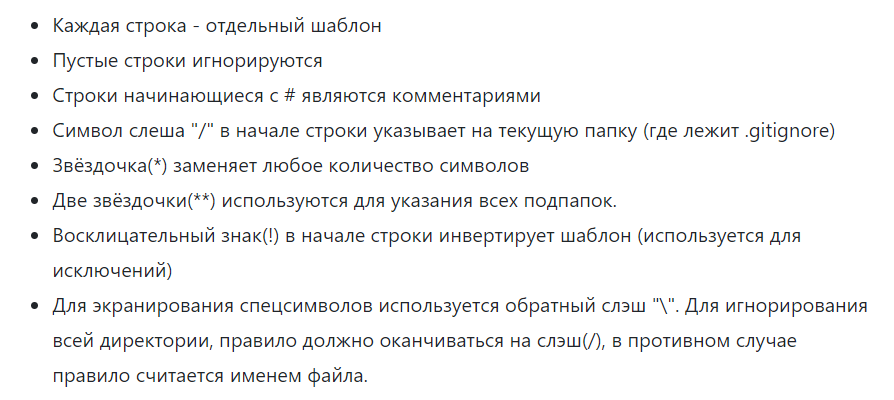
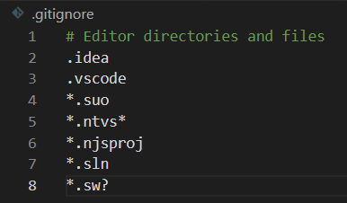

[К содержанию](./readme.md)

---

### Gitignore

&ensp;&ensp;&ensp;Cуществуют файлы, которые нельзя добавлять в репозиторий. К примеру: локальные настройки проекта, учётные данные, сведения об ошибках, библиотеки и т.п и т.д. Такие файлы требуется добавлять в игнорируемые для GIT.

&ensp;&ensp;&ensp;Файл __gitignore__ - это файл с описанием файлов, для которых не должно вестись отслеживание версий, имеет расширение ***.gitignore***.

Основные правила синтаксиса этого файла:

Пример файла:

---

[К содержанию](./readme.md)